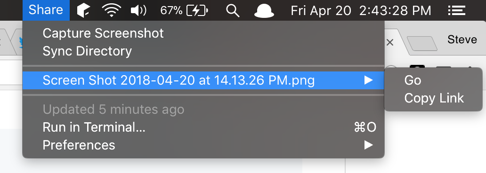

# BitBar Sync
Script for syncing a directory with a remote server that utilizes BitBar to display shared files.

Originally created to handle grabbing screenshots and sharing them with others.

## Installation
In order to get notifications you'll need to install [terminal-notifier](https://github.com/julienXX/terminal-notifier).

Modify the configuration variables in `sync.10m.rb`:
- `SCREENSHOT_DIRECTORY` - The directory on your computer which houses your screenshots and shared files. Include trailing slash.
- `LINK_PREFIX` - The URI to your shared folder on your server. Include trailing slash.
- `IGNORED_FILES = %w(. .. .DS_Store)` - Files which you'd like to ignore when listing.
- `RSYNC_USER` - The username for rsync to your server.
- `RSYNC_SERVER` - The address for rsync to your server.
- `RSYNC_FOLDER` - The folder on your server to rsync with your local directory.
- `TERMINAL_NOTIFIER_PATH` - The path to [terminal-notifier](https://github.com/julienXX/terminal-notifier).

You can modify the name of the file to indicate how often you would like BitBar to run it.

You will need to copy it into your BitBar plugins directory and `chmod +x` it.
### Rsync Setup
In order to setup rsync you'll need to make sure you have an SSH key and configuration setup on your Mac.

Example:

In `~/.ssh/config`
```bash
Host deploy.example.com
  User deployer
  IdentityFile ~/.ssh/deployer_rsa
```

The private key for this account is stored in `~/.ssh/deployer_rsa`

## Usage
You can use a task runner such as [Alfred](https://www.alfredapp.com/) to trigger the script with the `capture` argument to initiate a screen capture.

Alternatively, you can select the `capture` option from BitBar.  Once the screenshot has been captured, the sync event will be triggered and the URL will be copied to your clipboard.

You can also add any files you want to your `SCREENSHOT_DIRECTORY` and use the `Sync Directory` option to rsync the files.

## Delete
Rsync is being used with the `--delete` flag so files that are deleted should be deleted from the remote server.  It has also been instructed to `--exlude index.html` so you can block the directory root on your server.

## Thanks
- [Sara Bine](https://github.com/sbine) for the initial bash script that inspired this.

## Contribution
I don't write a lot of Ruby and BitBar is limited in that it's difficult to bring in external libraries.  Contributions are welcome!